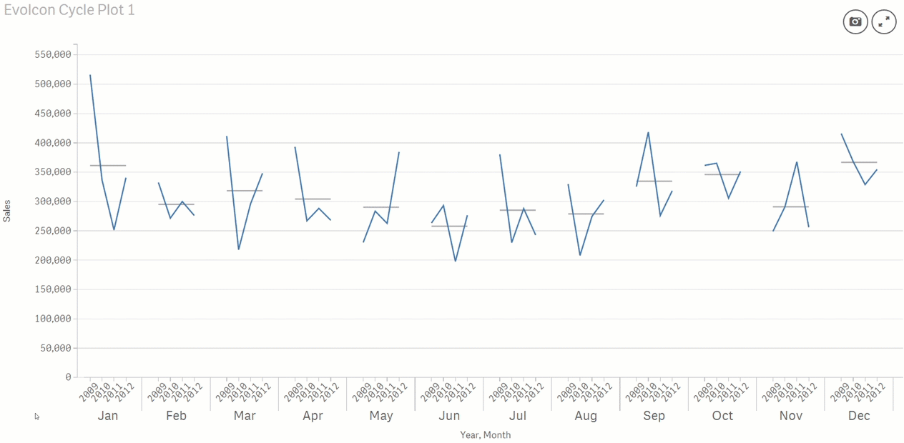

# Evolcon Cycle Plot
A cycle plot is an excellent way to clearly visualize changes in seasonal behavior over time. Find out more about how to use them in the following article blog post. 

You can find a **supported version** with more features on the <a href="https://www.vizlib.com/marketplace">**Vizlib Marketplace**</a>.

## Settings

### Dimensions
Define two date/time fields as dimensions. The first dimension is displayed along the x-axis and is a repetitive or seasonal element. For example, months in a year, days in a week or hours in a day. The second dimension describes the different instances of each repetitive or seasonal element. For example, years, weeks, or days, respectively.

### Measures
Define one measure that is used to display both the trend line and the mean line for each seasonal element. For example, sum(Sales).

### Options
* Define a calculation condition
* Personalize the color of the trend and the mean line.

## Versions

### 1.1.0
* Enabled calculation condition option.
* Made x-axis labels more responsive when there are more than 60 dimensional values.

## Author

**Karl Pover**

* [Harvesting Wisdom](http://poverconsulting.com)
* [twitter/karlpover](http://twitter.com/karlpover)

## License

Copyright © 2018 Alejandro Morales and Karl Pover, Evolcon

Released under the MIT license.

***
